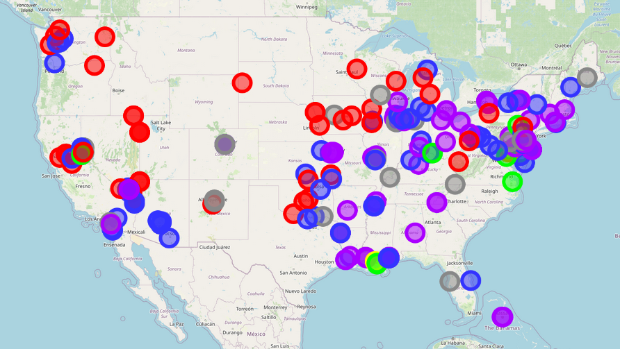
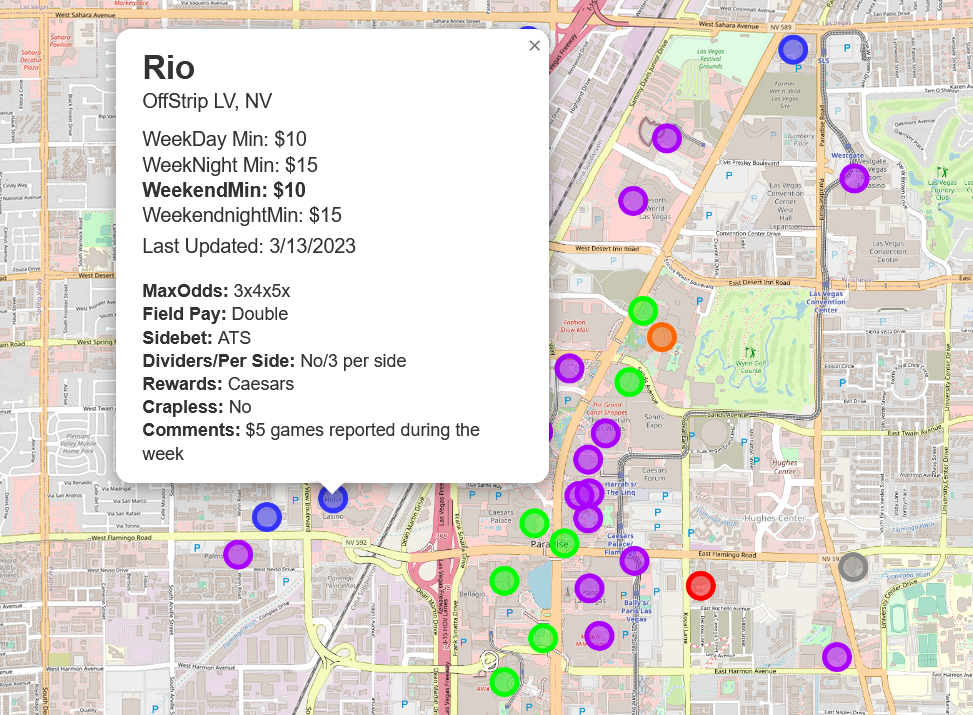

# Craps Table Minimum Map

&#127922; [See the map live here!](https://crapsmap.vercel.app/) &#127922;

Map of table minimums for Craps at casinos in the United States. Data is 
scraped from [/r/Craps](https://www.reddit.com/r/Craps/)'
[Spreadsheet of Minimums](https://www.reddit.com/r/Craps/comments/oo2p7q/casino_minimums_covid_edition_part_8/) and plotted
in Leaflet.js, overlain on OpenStreetMap.

## Running Locally

1. Install dependencies: [Node.js](https://nodejs.org/en/download) >=18, [Yarn](https://classic.yarnpkg.com/en/docs/install#windows-stable) v1
2. `git clone https://github.com/joshuaprince/minmap.git`
3. `cd minmap && yarn install`
4. `yarn dev`

## Configuration

The map is configured through environment variables. Copy `.env.example` to `.env.local` and make changes to configure the
data source, link targets, etc. Documentation for environment variables is in `.env.example`.

### Data Sources

The default configuration fetches map data from a static JSON file in this repository. To load map data from a
Google Sheet, populate the following environment variables:

| Environment Variable | Source                                                                                                        |
|----------------------|---------------------------------------------------------------------------------------------------------------|
| `SHEET_ID_MINS`      | URL of a Google sheet. This should be the long string of characters after `/d/` in the URL.                   |
 | `SHEETS_API_KEY`     | Make an account on [Google Cloud](https://console.cloud.google.com/apis/credentials) and generate an API key. |

## Contributing

Pull requests are welcome!
